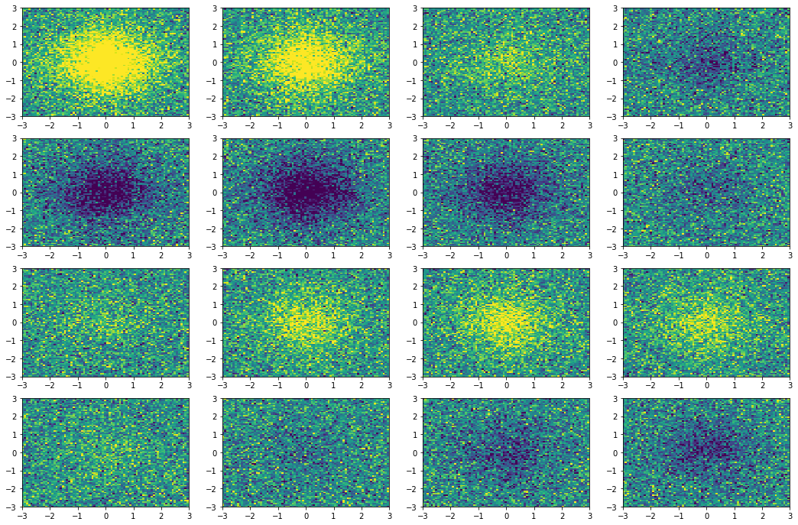

# Summary

Dynamic mode decomposition (DMD) is a model reduction algorithm developed by Schmid [@schmid2010dynamic]. Since then has emerged as a powerful tool for analyzing the dynamics of nonlinear systems. It is used for a data-driven model simplification based on spatiotemporal coherent structures. DMD relies only on the high-fidelity measurements, like experimental data and numerical simulations, so it is an equation-free algorithm. Its popularity is also due to the fact that it does not make any assumptions about the underlying system. See [@kutz2016dynamic] for a comprehensive overview of the algorithm and its connections to the Koopman-operator analysis, initiated in [@koopman1931hamiltonian], along with examples in computational fluid dynamics.
In the last years many variants arose, such as multiresolution DMD, compressed DMD, forward backward DMD, and higher order DMD among others, in order to deal with noisy data, big dataset, or spurius data for example. 
In the PyDMD package [@pydmd] we implemented in Python the majority of the variants mentioned above with a user friendly interface. We also provide many tutorials that show all the characteristics of the software, ranging from the basic use case to the most sofisticated one allowed by the package. 
The research in the field is growing both in computational fluid dynamic and in structural mechanics, due to the equation-free nature of the model.
As an exmaple, we show below few snapshots collected from a toy system with some noise. The DMD it is able to reconstruct the entire system evolution, filtering the noise. It is also possible to predict the evolution of the system in the future with respect to the available data.

Here we have the reconstruction of the dynamical system. You can observe the sensible reduction of the noise.

# Acknowledgements
This work was partially supported by European Union Funding for Research and Innovation — Horizon 2020 Program — in the framework of European Research Council Executive Agency: H2020 ERC CoG 2015 AROMA-CFD project 681447 “Advanced Reduced Order Methods with Applications in Computational Fluid Dynamics” P.I. Gianluigi Rozza.

# References